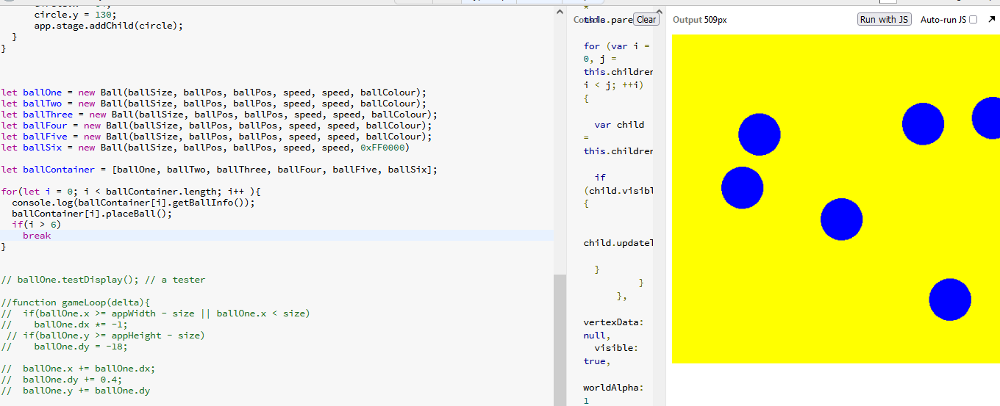

My progress with typescript language and pixi.js framework. Dave Ikin

Strategy.
break down the problem into smaller simple problems.
come up with a plan with a pen on paper first - code second.
get away from the computer whilst thinking about the task at hand and the plan.
if it doesnt work, its probably because i told it do do somthing incorrectly.

My first task in the plan was to break down the whole huge problem problem in to manageable portions;
--- TASK LIST : '*' == task done ---
1. *display a yellow canvas on the output
2. *create a simple Ball class and members even if it does not work properly
3. *initialize Ball objects from the class
4. *create a class method that outputs values of a Ball instance to the console ( getBallInfo() )
5. *itterate over multiple Ball objects using a for loop and output object member values to console
6. *create a class placeBall() method that returns a random starting position on the canvas so balls are
   randomly assigned starting positions. 
7. *using pixi.js method drawCircle(), create 20 instances of static ball graphics, callback the method
   placeBall() - just get them rendered to output, then i will work on movement.
8. Have the balls move, but not colide with the boundarys yet.
9. get the ball objects coliding of the boundarys of the canvas. 
10. organise a plan for task 2 & 3.

task - "Using the canvas, create 20 to 30 balls that bounce around the screen.
You should create a ‘ball’ class, then loop and create the balls, adding them to the stage. 
How many is up to you. The balls should place themselves at random starting positions and 
head off in different random directions. When they reach the edge of the canvas, they should 
bounce appropriately (there’s no requirement for ball vs ball interaction)."

30.07 - Im making a Ball class to order balls from,
which eventually should move around a container of 500px x 500px. Im going to use pixi.js 
framework to   make the graphics. there is a drawCircle method that im going to implement next 
altough im not quite sure of how how im going to do that yet. Possibly within a class method.

02.08 - It worked! from a Ball class, 6 blue coloured circular objects rendered in the container 
ordered from Ball and stored in an array, so progress made and im on the way. 
I feel like im really begining to think like a programmer now with my fresh approach to this task.
A for loop iterates over the array and hopefully will stop on the last item in the list...
Unfortunatley it doesnt stop and the console spits out some very interesting javaScript. Im not
sure what is going on but il find out no doubt as im making good progress and i also fell im
building momentum.

02.08 - I think my script is stuck in a loop, when i use jsbin an online environment 
for typescript the console goes crazy not like ive ever seen before. if anybody comes across 
this script take caution running it because i only noticed when my browser stoped responding
after about 3 mins so youl have plenty of time to stop the script. in jsbin deactivate 'auto run javascript'
thats what i did and it worked. im might have trouble debuging because of this problem.
i checked the task manager and the cpu had a lot of jobs than usual. Im wondering how this 
happened and i suspect it is the for loop at the bottom, im not sure how ive managed to get a
for loop stuck, i suspect its the condition and the sentry variable 'i' is not working, or ive mistyped
some syntax. Its probably likely i am not understanding somthing about my algorithm.

02.08 evening - When i successfully debugged my code at 2:50am i had gained much momentum and
decided that i will continue looking to finish the task and lost half of my day and most of 
my morning. The task is part of an examination i am taking. So far i have broken a complex task
down into many simple more mangeable chunks and i have made massive progress
using this technique - next bit - to make the balls move around the container. thats tonights job....

